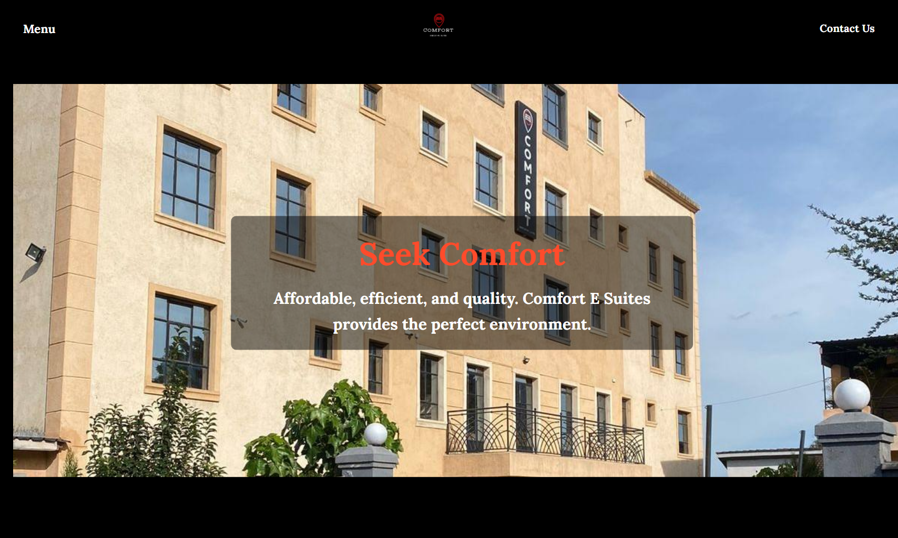
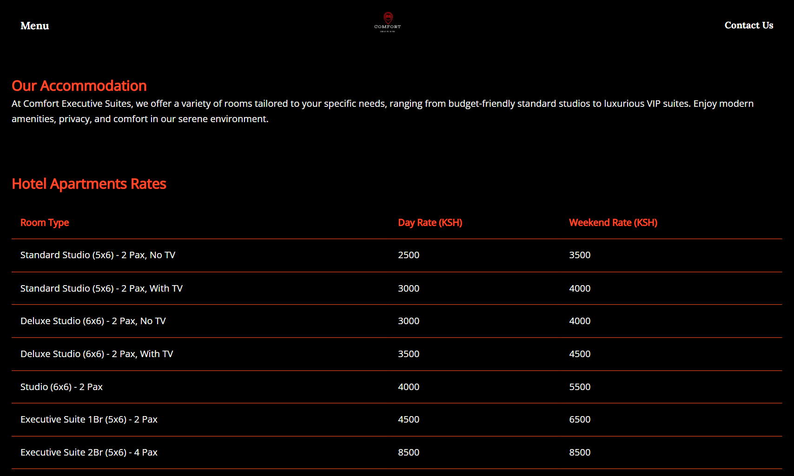
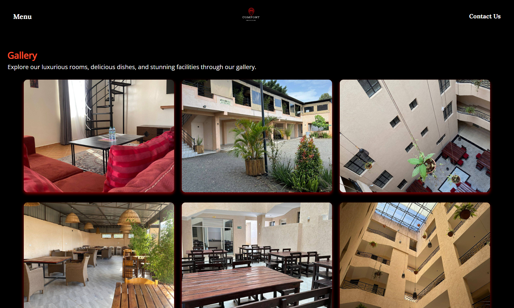
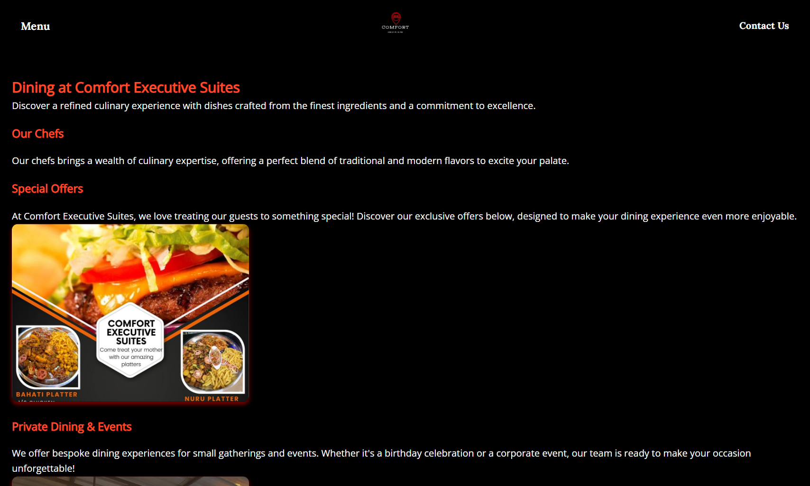
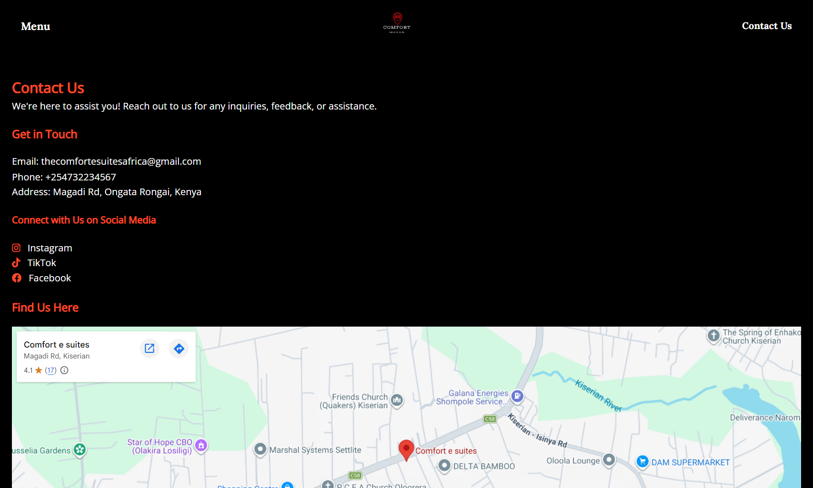
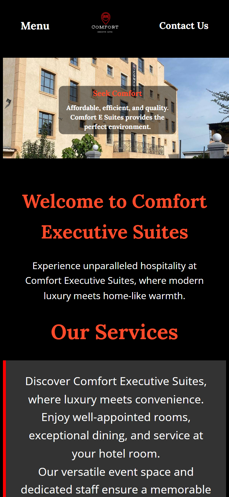
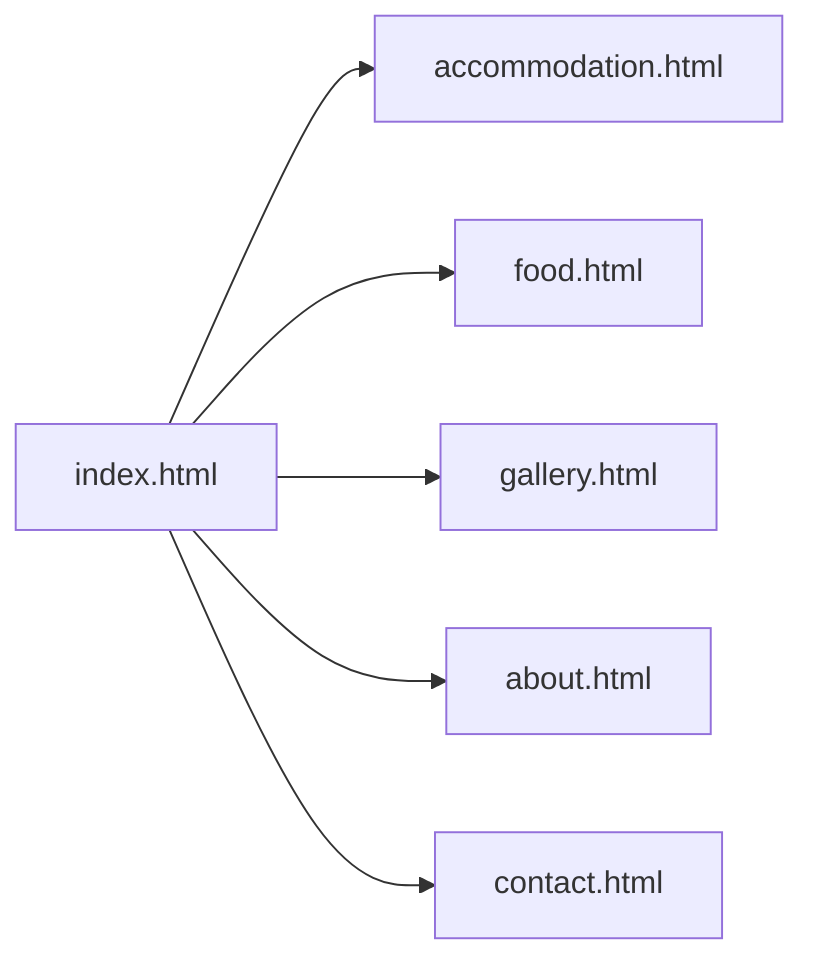

# Comfort Executive Suites Website


[](https://github.com/kinuthia-mark/comfort-website/actions/workflows/ci.yml)

The website for **Comfort Executive Suites**, a hotel on Magadi Road in Ongata Rongai, Kenya. It shows guests the rooms and rates, the dining options and photos of the property, and tells them how to get in touch.

**Live site:** <https://kinuthia-mark.github.io/comfort-website/>

It is a static site: plain HTML and CSS with no build step and no framework, so it loads quickly on mobile data and can be hosted anywhere.



| Accommodation | Gallery |
|---|---|
|  |  |
| **Dining** | **Contact** |
|  |  |

<p align="center"></p>

## Pages

| Page | File | What is on it |
|------|------|---------------|
| Home | `index.html` | Welcome banner, services, guest reviews, photo preview |
| Accommodation | `accommodation.html` | Rate table and the three room types: Studio, Executive Suite, VIP Suite |
| Dining | `food.html` | Restaurant, chefs, special offers, private dining and events |
| Gallery | `gallery.html` | Photo grid of rooms, dining and grounds |
| About Us | `about.html` | The hotel's story, mission and values |
| Contact | `contact.html` | Phone, email, social media links and a Google Map |



Every page shares the same header (menu, logo, Contact Us link) and footer.

## Design

- Black and reddish-orange colour scheme
- Lora for headings and Open Sans for body text (Google Fonts)
- Full-width photos with text overlays on the home page
- Hover effects on gallery images
- Each page has its own `<meta name="description">` so search results show a useful summary, plus Open Graph tags so links shared on WhatsApp, Facebook or X show a title, description and photo

## Performance

Most visitors arrive on a phone, often on mobile data, so page weight matters.

| Change | Effect |
|---|---|
| Photos resized to at most 1600 px and saved as progressive JPEG (quality 72) | Image folder went from 11 MB to 7.2 MB. The largest photos dropped from about 1 MB to under 330 KB |
| `loading="lazy"` and `decoding="async"` on every photo below the first screen | The browser only downloads gallery and room photos when the visitor scrolls to them |
| Camera metadata stripped and phone photos rotated upright | Smaller files, and no hidden details from the phone that took the photo |
| CI fails if any image is over 400 KB | A new 4 MB photo straight off a phone cannot slip in unnoticed |

### Mobile layout

`CSS/mobile.css` holds the media queries. On small screens the text is resized, the header stacks, and the photos scale to the screen width.

## Project structure

```text
comfort-website/
├── index.html
├── accommodation.html
├── food.html
├── gallery.html
├── about.html
├── contact.html
├── .github/workflows/ci.yml   # HTML validation, link check, image budget
├── .htmlvalidate.json        # Validator rules
├── docs/screenshots/         # Images used in this README
├── CSS/
│   ├── styles.css     # Shared base styles: fonts, header, footer
│   ├── index.css      # Home page sections and image overlays
│   ├── gallery.css    # Gallery grid and hover effects
│   ├── table.css      # Rate table on the accommodation page
│   ├── contact.css    # Contact page layout
│   └── mobile.css     # Media queries for phones and small tablets
└── images/            # Room, dining and building photos, plus the logo
```

## Quality checks

GitHub Actions (`.github/workflows/ci.yml`) runs on every push and pull request:

| Check | Tool | What it catches |
|---|---|---|
| HTML validation | [html-validate](https://html-validate.org) | Unclosed tags, elements in the wrong place, missing attributes. It found and fixed an unclosed `<div>` that put the whole gallery page inside its header, an `` inside `<head>`, and a map `<iframe>` without a title for screen readers |
| Link check | [lychee](https://github.com/lycheeverse/lychee) (offline mode) | Any link, image or stylesheet that points at a file that does not exist |
| Image budget | `find images -size +400k` | Oversized photos |

To run the HTML check locally:

```bash
npx html-validate *.html
```

## Running it locally

No install is needed. Either open `index.html` in a browser, or serve the folder so the links behave exactly as they do online:

```bash
git clone https://github.com/kinuthia-mark/comfort-website.git
cd comfort-website
python -m http.server 8000
```

Then open <http://localhost:8000>.

## Deployment

The site is published with GitHub Pages from the `master` branch. Any change merged into `master` goes live within a minute or two.

## Analytics

Each page includes the Meta Pixel, so visits from Facebook and Instagram adverts can be measured in Meta Events Manager.

## Ideas for next steps

- Online booking form or a booking calendar
- Serve WebP versions of the photos through `<picture>` for another 25-35% saving
- A virtual tour of the rooms
- Seasonal offers section that is easy to update

## Author

**Mark Kinuthia** - [github.com/kinuthia-mark](https://github.com/kinuthia-mark)
